# 说明书

## 1.介绍

一款用于解析支付宝/微信账单的Python可视化工具

- 支持支付宝/微信双平台账单解析
- 月度消费报告生成

## 2.如何使用

* 安装python，项目使用的是python3.13.2
* 安装依赖  
  `pip install -r requirements.txt`
* 在Bill_Analyzer目录下打开终端输入  
  `python main.py`
* 运行界面
  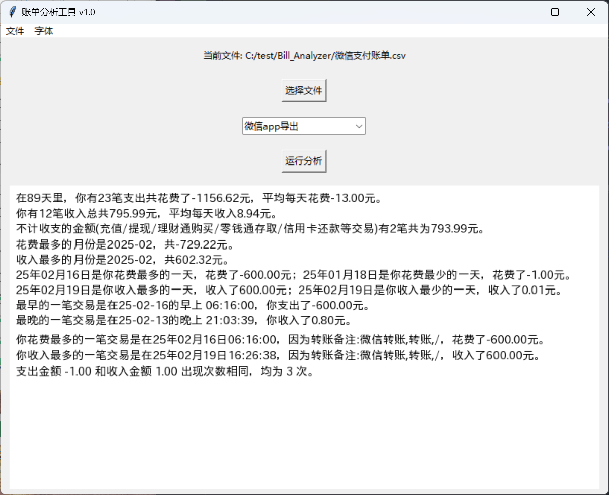
  点击选择文件选择对应的文件，之后点击运行分析。

## 3.账单下载

    
支付宝网页版

    打开浏览器搜索支付宝然后按照指引操作
        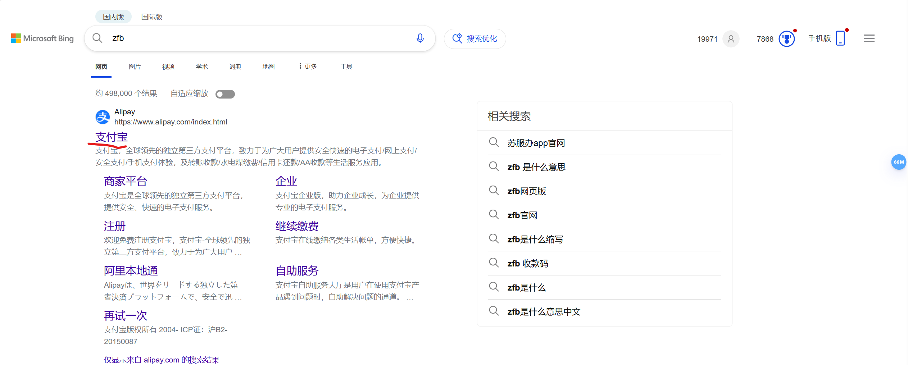
        
        
        点击后有二维码登陆
        
        日账单是按天算的而且只能导出一个月的，月账单可以多下几个月，代码测试是用月账单试的
        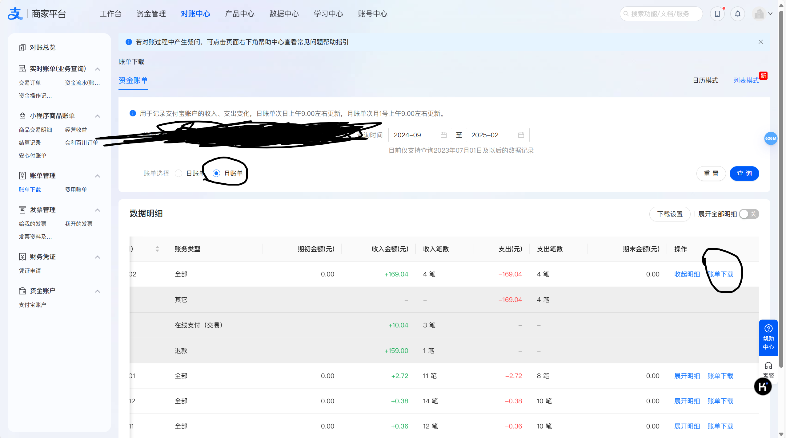
        账务明细是要分析的账单
        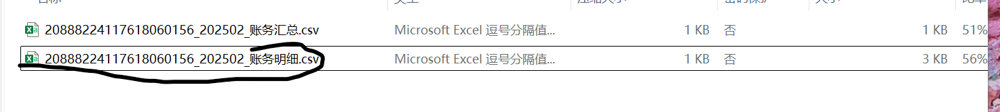

    
支付宝App

    打开支付宝按照指引操作：
        
        
        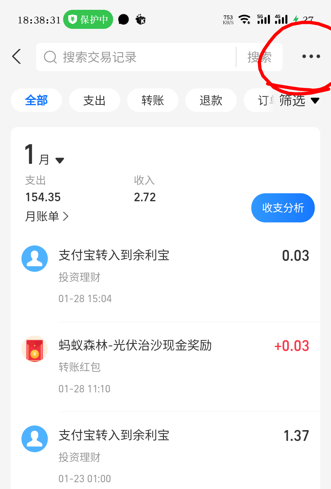
        
        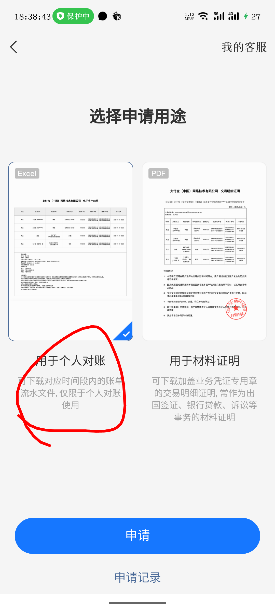
        点击下一步后输入邮箱接收账单压缩包，压缩包有密码会发到支付宝上在消息里查看
        

    
微信

    打开微信按照指引操作：
        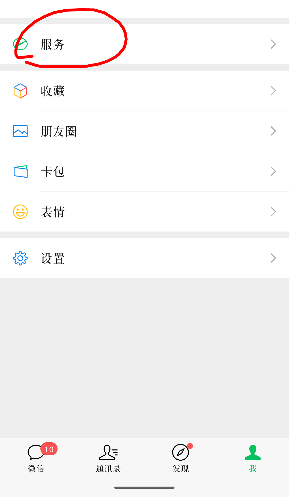
        
        
        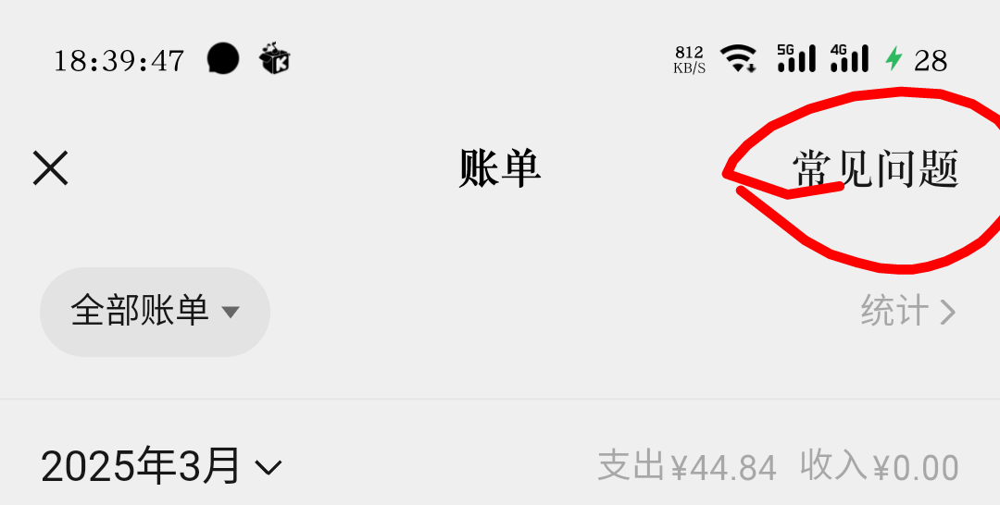
        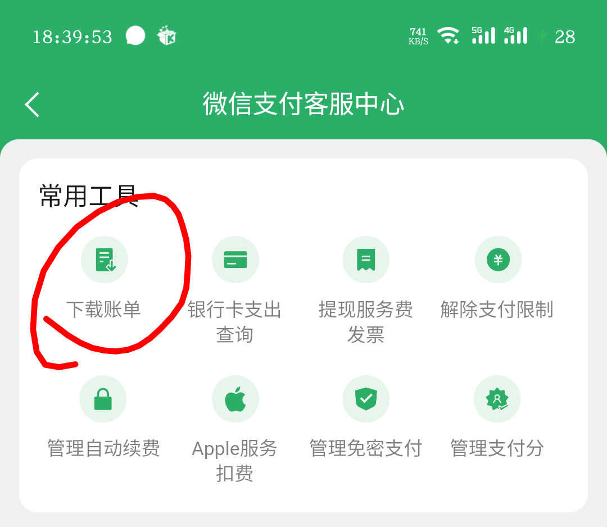
        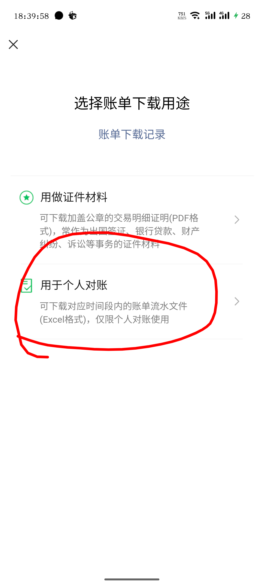
        点击下一步后输入邮箱接收账单压缩包，压缩包有密码会发到微信上在消息里查看
        

---

## 4.杂项

  
打包为exe程序

    在Bill_Analyzer目录下打开终端输入  
      <pre><code class="language-cmd">pip install pyinstaller</code></pre>  
      <pre><code class="language-cmd">pyinstaller build.spec</code></pre>  
    打包后在\Bill_Analyzer\dist\BillAnalyzer\_internal文件夹里找到f_ont文件夹，
    将f_ont文件夹复制到\Bill_Analyzer\dist\BillAnalyzer文件夹⬇️
    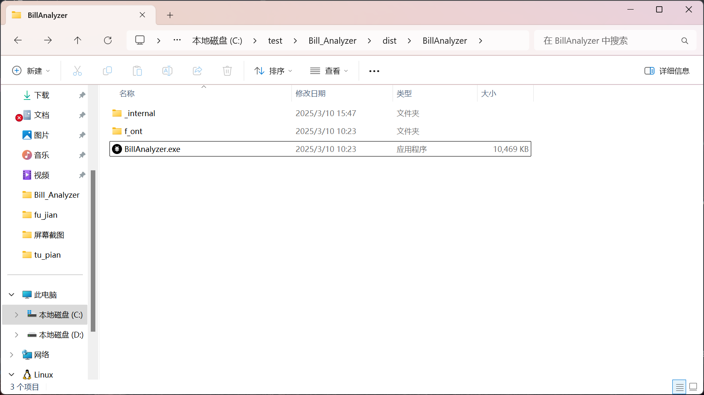
    双击BillAnalyzer.exe打开程序
    <ul>
      <li>f_ont是字体文件夹可以在里面放置自己喜欢的字体运行的时候在字体菜单栏选择</li>
      <li>Bill_Analyzer\fu_jian\favicon.ico是图标文件可以放置自己喜欢的图标后重命名为favicon.ico</li>
    </ul>

  
📦 UPX安装指南（点击展开）

    

      <h3 style="color: #3498db;">Windows系统</h3>
      <ul>
          <li>🎯 <strong>下载安装包</strong> 
              访问<a href="https://upx.github.io/" target="_blank" style="color: #e74c3c;">UPX官网</a>下载最新Windows版本（如<code>upx-5.0.0-win64.zip</code>）
          </li>
          <li>📂 <strong>解压文件</strong>
              <pre><code class="language-powershell">Expand-Archive -Path .\upx-*.zip -DestinationPath C:\upx</code></pre>
          </li>
          <li>⚙️ <strong>配置环境变量</strong>
              <ol>
                  <li>右键"此电脑" → 属性 → 高级系统设置 → 环境变量</li>
                  <li>在系统变量的Path中添加：<code>C:\upx</code></li>
              </ol>
          </li>
          <li>✅ <strong>验证安装</strong>
              <pre><code class="language-cmd">upx --version</code></pre>
          </li>
      </ul>
      <h3 style="color: #3498db;">macOS系统</h3>
      

        <pre><code class="language-bash">
      # 使用Homebrew安装
      brew install upx
      # 验证安装
      upx --version</code></pre>
      

      <h3 style="color: #3498db;">Linux系统</h3>
      

        <pre><code class="language-bash">
      # Debian/Ubuntu
      sudo apt install upx-ucl
      # CentOS/RHEL
      sudo yum install upx
      # 验证安装
      upx --version</code></pre>
      

      <h3 style="color: #e67e22;">⚠️ 注意事项</h3>
      <ul style="list-style-type: '🔔';">
          <li>推荐安装最新版UPX（当前最新5.0.0）</li>
          <li>遇到路径问题时使用：
              <pre><code class="language-bash">pyinstaller --upx-dir=C:\upx build.spec</code></pre>
          </li>
          <li>安装完成后重新执行：
              <pre><code class="language-bash">pyinstaller build.spec</code></pre>
          </li>
      </ul>
    

  
使用项目到其他地方要注意什么？

  许可协议是
  <a href="./LICENSE" target="_blank" rel="noopener noreferrer">CC BY 4.0 许可协议</a>，
  使用时要注意
  <ul>
    <li>必须标注作者署名（ee19971）</li>
    <li>允许自由修改和分发</li>
    <li>允许商业使用</li>
  </ul>

## 5.许可信息

包含来自[Remix Icon](https://remixicon.com/)
的图标资源，遵循其 [开源协议](https://github.com/Remix-Design/RemixIcon/blob/master/License)

[Bill_Analyzer](https://github.com/ee19971/Bill_Analyzer) by [ee19971](https://github.com/ee19971) is licensed
under [Creative Commons Attribution 4.0 International](https://creativecommons.org/licenses/by/4.0/?ref=chooser-v1)

- 保留原始作者署名
   
